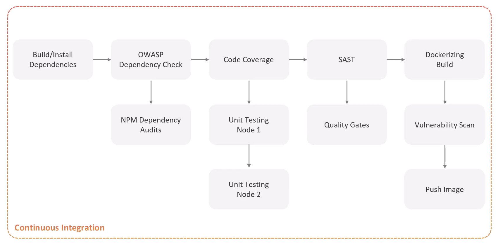
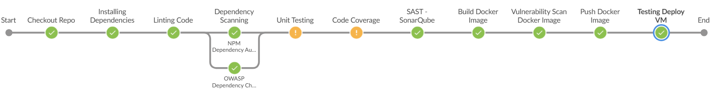
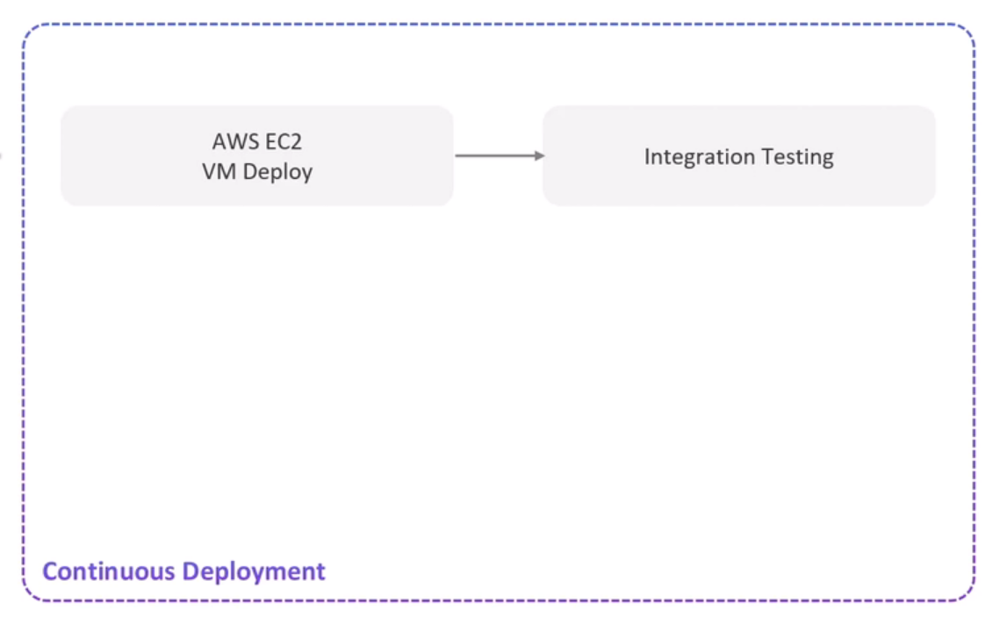
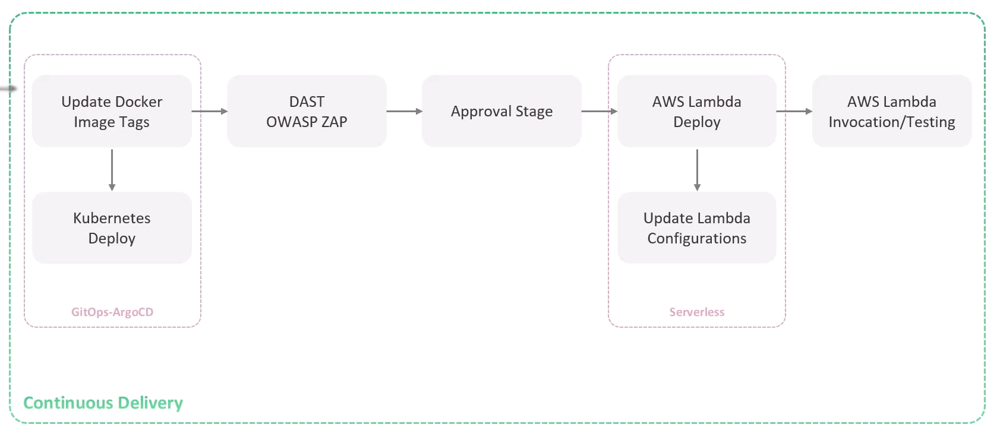
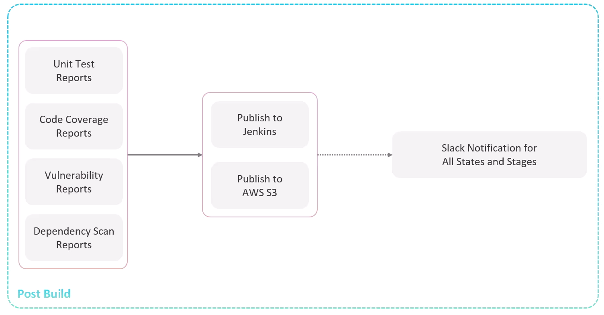

# Jenkins Full CI/CD Pipeline for Node.js + MongoDB App

This project demonstrates a complete CI/CD pipeline built with **Jenkins**, using a Node.js application with a MongoDB backend. The pipeline automates building, testing, and Deployment.

## 🧰 Stack
- **Jenkins** (CI/CD automation)
- **Node.js** (Application)
- **MongoDB** (Database)
- **Jenkins Plugins**:
  - Git
  - Blue Ocean
  - NodeJS Plugin

---

## 📁 Project Structure

```bash
.
├── App-SourceCode
├── Jenkinsfile
├── .gitignore
└── README.md
```
## Continuous Integration
- Using Feature based branch (New Branch for new features)
- Develop the feature and build test (Unit/integration)
- **Scan Dependencies** -> Linting -> **Sast(Quality Gate)** -> Build Image -> **Image Scanning**
<div style="text-align: center;">

</div>

> ###  CI Pipeline Stages
- Checkout Code
- Install Dependencies
- Lint Code
- Dependency Scanning
- Unit Testing
- Code Coverage
- SAST Analysis (َQuality Gate) `SonarQube`
- Docker Image Build
- Docker Image Scan
- Docker Image Push

> ###  CD Pipeline Stages
- Testing Deploy VM
- K8S Update Image Tag
- Raise PR (Manifests Repo: new Image Tag)
- Approve App Deployment 
- DAST - OWASP ZAP
- Admin Prod Approve 
- 
- Smoke testing

<!-- <div style="text-align: center;">

</div> -->

--- 

- > Skills Applied
  - *tools*, *parameters*, *environment*, *Options* & *post*
  - *input* , *timeout* & *when*
  - Credentials:
    - `withCredentials`
    - Using `Credentials()` in `environment{}`
  - Error Handling:
    - `catchError`
  - Tests & Artifacts:
    - `publishHTML`
    - `junit`
  - Security:
    - `withSonarQubeEnv()`   
    - `waitForQualityGate()` 
  - Docker:
    - `withDockerRegistry()`
  - Cloud:
    - `withAWS()`
    - `s3Upload()`


<div style="text-align: center;">

</div>


## Continuous Deployment/Delivery
- `Deploy` the new feature in dev Env
- Run `integration testing`
- After success, Create `Pull Request` for review `PR`
<div style="text-align: center;">

</div>

---
- update configuration (ImageTag)
- DAST testing
- After success, Approve `Pull Request`
- Deploy to production using strategies

<div style="text-align: center;">

</div>

## Post Build
- Collect reports
- Notify admin using slack/email
<div style="text-align: center;">

</div>


## Notes Best Practice
- To enable css in jenkins:*System.setProperty("hudson.model.DirectoryBrowserSupport.CSP", "")
*

### Backup & Restore in Jenkins
```bash
tar -czvf /backup/jenkins-backup.tar.gz -C /var/lib/jenkins .
tar -xzvf /backup/jenkins-backup.tar.gz -C /var/lib/jenkins
```

### Linting Stage
Linting is the process of analyzing your code for *potential errors*, *style issues*, and *bad practices* without executing it.
- In Node.js, we typically use `ESLint` popular JavaScript linter.