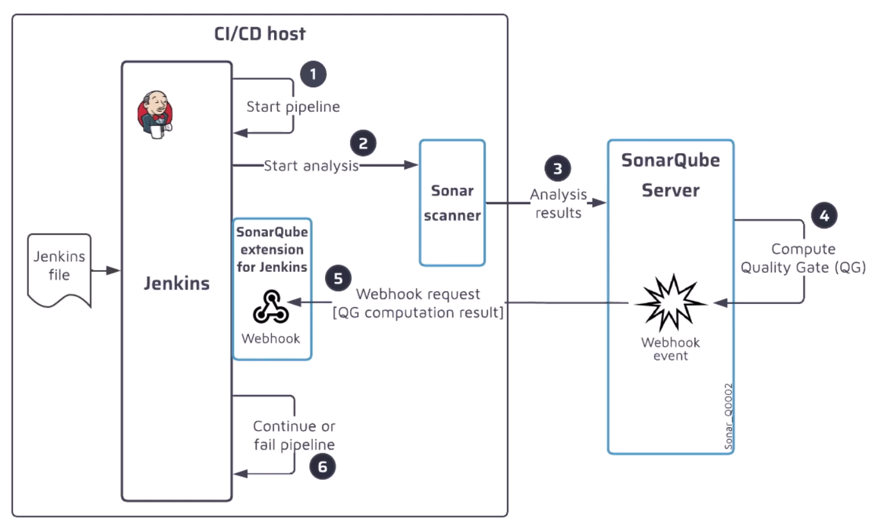

# Jenkins Full CI/CD Pipeline for Node.js + MongoDB App

This project demonstrates a complete CI/CD pipeline built with **Jenkins**, using a Node.js application with a MongoDB backend. The pipeline automates building, testing, and Deployment.

## Stack
- **Jenkins** (CI/CD automation)
- **Node.js** (Application)
- **MongoDB** (Database)
- **Jenkins Plugins**:
  - Git
  - Blue Ocean
  - NodeJS Plugin
  - Slack Notification
  - Email Extension
  - Junit / publishHTML
  - AWS
  - Docker
  - SSH 
- **Security**:
  - trivy
  - SonarQube
  - OWASP ZAP 

---

## Project Structure

```bash
.
├── App-SourceCode
├── Images
├── Jenkinsfile
├── .gitignore
└── README.md
```


## Jenkins Intro
- Jenkins is CI/CD Tool for automated tasks
- Core Concepts:
- `Pipelines`: chain of Jobs automated tasks
- `Stages`: Group of related jobs
- `Jobs`: Building block of the pipeline. (ex: test code)
- `Builds`: Each exec of jobs in jenkins, History of execution units
- `Freestyle`: flexible job definition
- `Nodes`: Machines where jenkins execute jobs
- `Plugins`: Extend jenkins function with tools


## Jenkins Architecture
- Jenkins Controller Node `Server`
    - Management task & Jobs
- Nodes `Worker nodes`
    - Machine that controlled by the controller as Slaves
    - Communicate with controller via SSH
    - Each has Executors (Thread for execution tasks)
- Agents `extension of Jenkins`
    - manage task exec by using executors on the node
- `Jenkins job types`:
    - `Freestyle Project`: A basic job type that lets you configure builds through 
    - `Pipeline`: A job that defines the entire CI/CD process using code (Jenkinsfile).
    - `Multibranch Pipeline`: Automatically scans a Git repository for branches and creates a separate pipeline job for each branch.
    - `Folder`: Used to group and organize Jenkins jobs into folders. 
    - `Organization Folder`: Create a set of Multibranch project subfolders by scanning for repo
<div style="text-align: center;">

</div>

## Jenkins Agent

### VMs
- First we need to determine the number of executers
- No. executors <= No of CPUs 
- Setup Node Agent
    - Install Java Requirements
    - Make Dir for working agent make right ownership for the dir
    - If using ssh to access the node we should know which port we use ex: 22, 2222
- Setup Jenkins Controller
    - Install Java Requirements & Jenkins 
    - Add New Node 
---
### Kubernetes
- Prerequisite
  - Setup a kubeadm cluster and expose the control plan url 
  - First Install Kubernetes plugin in jenkins
- Steps
  - `[Jenkins Controller]`:: Choose configure cloud --> Kubernetes
  - `[Jenkins Controller]`:: Copy Kubernetes server ca.crt to configuration
  - `[Jenkins Controller]`:: Put control plane URL, Namespace
  - `[Jenkins Controller]`:: Choose WebSocket Connection between pods --> Jenkins
  - `[Kubernetes Server]`:: create a namespace for jenkins
  - `[Kubernetes Server]`:: Create Service account & Token
  - `[Kubernetes Server]`:: Create Role & Rolebinding for this serviceaccount 
  - `[Kubernetes Server]`:: Give the sufficient permissions for the role so jenkins agent can perform its tasks 
---


## Jenkins Pipelines
- Styles: 
    - **Declarative**: modern, cleaner, and more structured way to write Jenkins pipelines.
    - **Scripted**: when need complex loops, conditions, or Groovy scripting
- `Pipeline Configuration`  
    - agent: spesify the agent to run this pipeline in 
    - environment: define environment variables to use across the pipeline
    - parameters: inject parameters to pipelines for dynamic exec
    - Script:  to run script in the pipeline
    - when: conditions to run this part
    - input: used to pause the pipeline and wait for human interaction.
    - stash/unstash: Save and retrieve files between stages or agents
    - withCredentials: use creds to run this part
    - parallel: run parallel stages
    - post: run after finish the pipelines


# Continuous Integration, Continuous Deployment & Continuous Delivery
- `Continuous Integration` **CI**: frequently integrating code from multiple developers into a shared repository
- `Continuous Deployment` **CD**: automatically released to production without human intervention.
- `Continuous Delivery` **CD**: automatically released to production but requires manual approval.


## Continuous Integration
- Using Feature based branch (New Branch for new features)
- Develop the feature and build test (Unit/integration)
- **Scan Dependencies** -> Linting -> **Sast(Quality Gate)** -> Build Image -> **Image Scanning**
<div style="text-align: center;">

</div>

> ###  CI Pipeline Stages
- Checkout Code
- Install Dependencies
- Lint Code
- Dependency Scanning
- Unit Testing
- Code Coverage
- SAST Analysis (َQuality Gate) `SonarQube`
- Docker Image Build
- Docker Image Scan
- Docker Image Push
- Notify Slack

> ###  CD Pipeline Stages
- Testing Deploy VM
- K8S Update Image Tag
- Raise PR (Manifests Repo: new Image Tag)
- Approve App Deployment 
- DAST - OWASP ZAP
- Admin Prod Approve 
- Deploy to Production (AWS Lambda)
- Smoke testing
- Notify Slack

<!-- <div style="text-align: center;">

</div> -->

--- 


<div style="text-align: center;">

</div>


## Continuous Deployment/Delivery
- `Deploy` the new feature in dev Env
- Run `integration testing`
- After success, Create `Pull Request` for review `PR`
<div style="text-align: center;">

</div>

---
- update configuration (ImageTag)
- DAST testing
- After success, Approve `Pull Request`
- Deploy to production using strategies

<div style="text-align: center;">

</div>

## Post Build
- Collect reports
- Notify admin using slack/email
<div style="text-align: center;">

</div>


# Notes Best Practice
- To enable css in jenkins:**System.setProperty("hudson.model.DirectoryBrowserSupport.CSP", "")**

## Jenkins Automation
- Using CLI (SSH/Jar)
     - Install jenkins-cli.jar then use the cli to control jenkins
- Jenkins REST API 

```bash
wget http://192.168.56.20:8080/jnlpJars/jenkins-cli.jar
java -jar jenkins-cli.jar -s http://192.168.56.20:8080/ -auth mac:mac list-jobs
# REST API
curl -u mac:mac http://192.168.56.20:8080/api/json
```

## Jenkins Security
- Authentication: *Create Users & Groups*
    - `[Jenkins User Database]` Jenkins use its own user database to store user creds
    - `[Unix User/Group Database]` Jenkins use Unix as source of user/groups DB
    - `[LDAP]`
- Authorization: *Manges permission and Access Control rules*
    - `[Matrix Authorization Strategy]` Fine access control
        - Global or Project Base

## Jenkins Config

### Settings
- `Build Timeout` (Global, build level): 
    - Configure a time for a build to run within 
    - Configure a time-out action to do (*Abort*)
- `TimeStamper`: Add time stamp for your build logs
- `Environment variable`: adding to global env variable for reusability
- `Manage OldData`: removing plugin permanently
- `fingerprint`: unique identifier (hash) used to track files (usually build artifacts) across different jobs and builds.

### Plugins
- **Copy Artifact** `Share files`: Copy files from a build to another 
    - Give permission to **test** to copy artifact 
    - Archive the artifact in **build**
    - Load artifact in **test** then use it 
- Visualization:
    - Yet Another Build Visualizer Plugin
- Blue Ocean 
- Email Extension / Slack


## Backup & Restore in Jenkins
```bash
tar -czvf /backup/jenkins-backup.tar.gz -C /var/lib/jenkins .
tar -xzvf /backup/jenkins-backup.tar.gz -C /var/lib/jenkins
```

Linting is the process of analyzing your code for *potential errors*, *style issues*, and *bad practices* without executing it.
- In Node.js, we typically use `ESLint` popular JavaScript linter.

## Jenkins Administration
- Markup formatters
- Job Restrictions with rules
- Job configuration History Plugin (Logs)
- Build Monitor View Plugin
- Monitoring using Java Melody
- Jenkins Scaling -> **Add Worker Nodes**

## Linting Stage